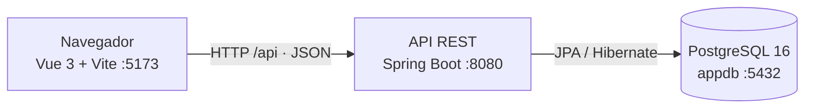
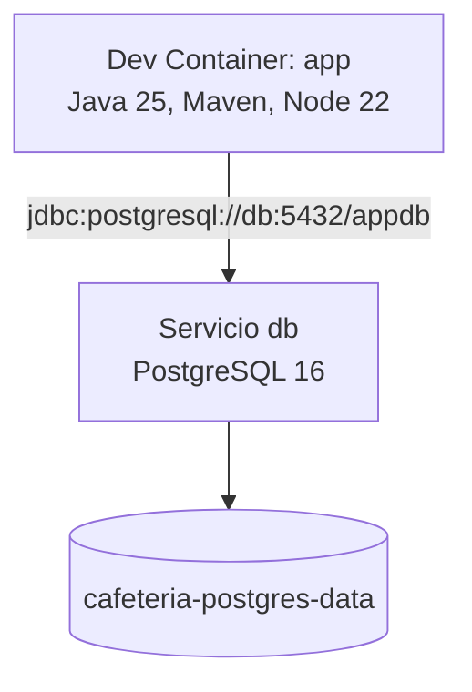
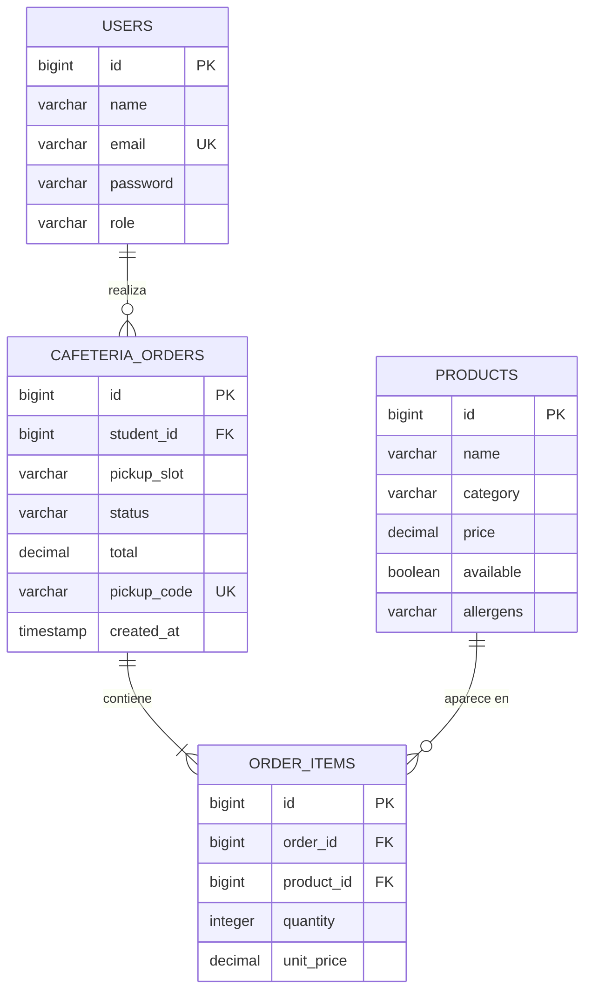
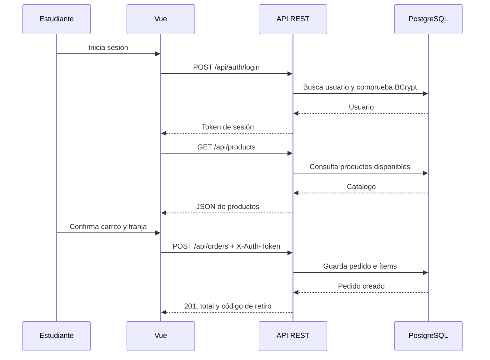

# Arquitectura y modelo de datos — COOP UES

## Objetivo del MVP

El MVP permite a un estudiante crear una cuenta, iniciar sesión, consultar el catálogo, armar un carrito, elegir una franja de retiro y crear un pedido. Es un monolito modular: las capas se mantienen juntas para simplificar el desarrollo, pero el código se organiza por responsabilidad.

## Arquitectura

El servidor de desarrollo de Vite reenvía las rutas que comienzan con `/api` a Spring Boot. Por eso el frontend nunca necesita conocer host, puerto ni credenciales de la base de datos.

## Contenedores de desarrollo

El volumen conserva los datos entre reinicios. El nombre específico del volumen evita reutilizar por accidente una base local antigua con otras credenciales.

## Capas y módulos

| Capa | Ubicación | Responsabilidad |
| --- | --- | --- |
| Vista | `frontend/src/App.vue` | Formularios, catálogo, carrito, mensajes y pedidos reactivos. |
| Cliente API | `frontend/src/composables/useAuth.js` | Registro, login, token de sesión y llamadas autenticadas. |
| Auth | `backend/.../auth` | Usuarios, BCrypt, registro, login, logout y validación del token. |
| Catálogo | `backend/.../catalog` | Productos disponibles y carga de productos de ejemplo. |
| Pedidos | `backend/.../orders` | Validación del carrito, total, código de retiro y persistencia del pedido. |
| Persistencia | PostgreSQL + JPA | Tablas, relaciones y almacenamiento transaccional. |

## API REST

| Método | Ruta | Uso | Autenticación |
| --- | --- | --- | --- |
| `POST` | `/api/auth/register` | Crea una cuenta de estudiante. | No |
| `POST` | `/api/auth/login` | Inicia sesión. | No |
| `POST` | `/api/auth/logout` | Invalida la sesión actual. | `X-Auth-Token` |
| `GET` | `/api/auth/me` | Obtiene la persona de la sesión. | `X-Auth-Token` |
| `GET` | `/api/products` | Lista productos disponibles. | No |
| `GET` | `/api/pickup-slots` | Lista franjas de retiro del MVP. | No |
| `POST` | `/api/orders` | Crea un pedido confirmado. | `X-Auth-Token` |
| `GET` | `/api/my/orders` | Muestra los pedidos del estudiante. | `X-Auth-Token` |

Las rutas son recursos REST, los métodos HTTP expresan la acción y las respuestas son JSON. Un registro correcto devuelve `201 Created`; validaciones incorrectas devuelven `400`, credenciales inválidas `401` y un correo ya registrado `409`.

## Modelo de datos

### Decisiones del modelo

- Un usuario puede tener muchos pedidos; cada pedido pertenece a un estudiante.
- Un pedido contiene uno o más ítems. Cada ítem guarda la cantidad y el precio unitario aplicado al crear el pedido, para que futuros cambios de precio no alteren el historial.
- Un producto puede estar presente en muchos ítems de pedido.
- El pedido guarda un `pickup_code` único, que es el código corto para retirar en ventanilla.
- `status` inicia como `RECIBIDO`. El flujo operativo futuro será `RECIBIDO → EN_PREPARACION → LISTO → ENTREGADO`.
- Las contraseñas nunca se guardan en texto plano: se almacenan como hashes BCrypt.

## Flujo de un pedido

## Límites explícitos del MVP

El sistema ya tiene una base adecuada para extenderse, pero todavía no implementa inventario real, pagos con saldo o Stripe, billetera/libro mayor, roles operativos, actualización de estados ni notificaciones. Esos módulos deben incorporarse después con migraciones versionadas —por ejemplo, Flyway— y pruebas de integración para cada regla de negocio.
